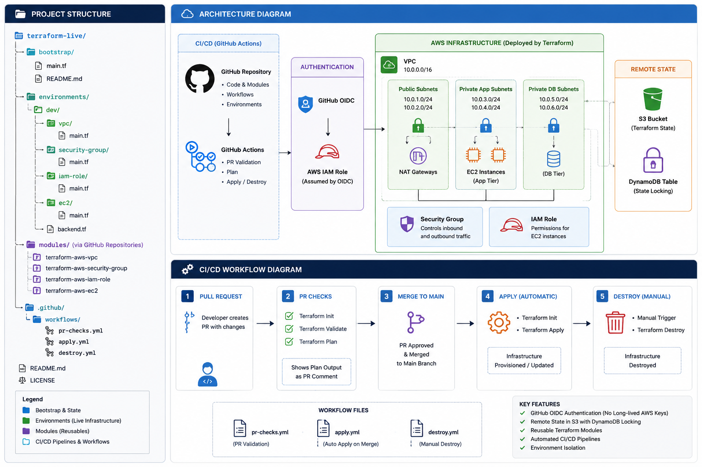
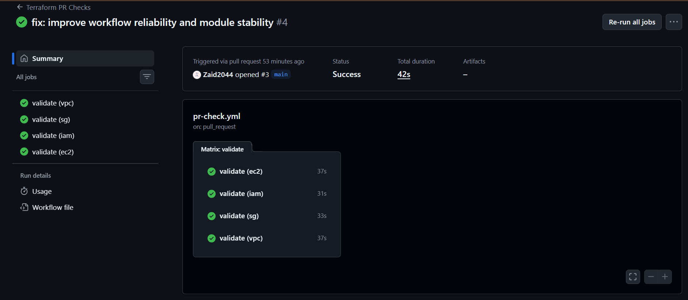
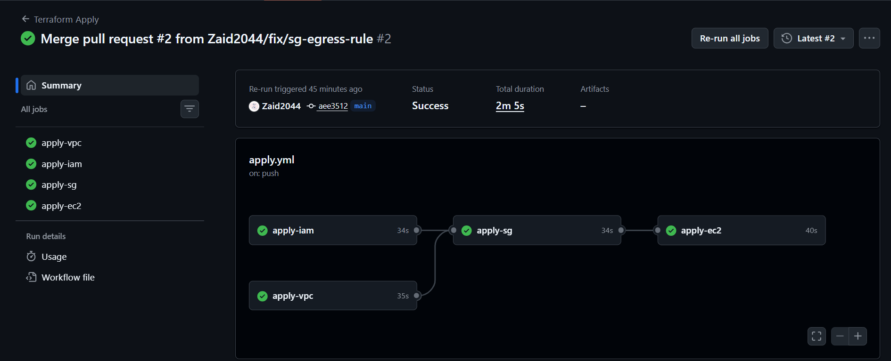
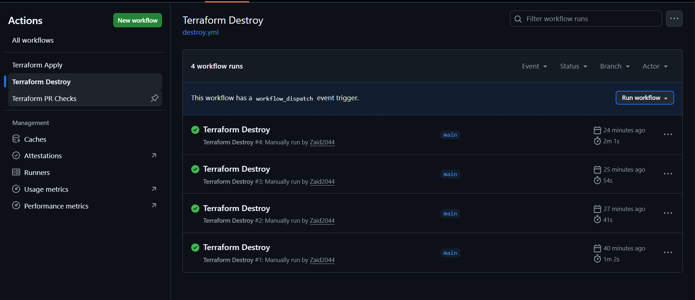

# Terraform AWS Platform 🚀

Production-grade Infrastructure as Code platform built with Terraform, AWS, GitHub Actions, and GitHub OIDC.

This project demonstrates how to design, provision, secure, and automate AWS infrastructure using reusable Terraform modules and modern CI/CD practices.

---

## 📌 Project Highlights

✅ Reusable Terraform Modules
✅ Remote State Management (S3)
✅ State Locking (DynamoDB)
✅ GitHub OIDC Authentication
✅ Pull Request Validation
✅ Automated Deployment on Merge
✅ Manual Infrastructure Destruction
✅ Environment-Based Infrastructure Layout
✅ Cross-Stack Dependencies using Remote State
✅ Zero Long-Lived AWS Credentials

---

## 🏗️ Architecture



### Infrastructure Components

| Layer            | Components                                                                 |
| ---------------- | -------------------------------------------------------------------------- |
| Network          | VPC, Public Subnets, Private Application Subnets, Private Database Subnets |
| Security         | Security Groups                                                            |
| Identity         | IAM Roles, Instance Profiles                                               |
| Compute          | EC2 Instances                                                              |
| State Management | S3 Backend, DynamoDB Locking                                               |
| Automation       | GitHub Actions, GitHub OIDC                                                |

---

## 🧩 Module Architecture

The infrastructure is built using independently versioned Terraform modules.

```text
terraform-aws-vpc
terraform-aws-security-group
terraform-aws-iam-role
terraform-aws-ec2
```

Each module follows:

* Semantic Versioning
* Independent Releases
* Reusability Across Environments
* Input Validation
* Outputs for Cross-Stack Integration

---

## 📂 Repository Structure

```text
terraform-live/
│
├── bootstrap/
│   ├── backend.tf
│   ├── main.tf
│   └── outputs.tf
│
├── environments/
│   └── dev/
│       ├── github-oidc/
│       ├── vpc/
│       ├── sg/
│       ├── iam/
│       └── ec2/
│
├── docs/
│   └── images/
│
└── .github/
    └── workflows/
        ├── pr-check.yml
        ├── apply.yml
        └── destroy.yml
```

---

## 🔐 Authentication Flow

Traditional CI/CD pipelines often rely on static AWS access keys.

This platform uses GitHub OpenID Connect (OIDC) to securely authenticate GitHub Actions with AWS.

```text
GitHub Actions
        │
        ▼
GitHub OIDC
        │
        ▼
AWS IAM Role
        │
        ▼
Terraform
```

### Benefits

* No AWS Access Keys
* No Secret Rotation
* Short-Lived Credentials
* Improved Security
* Industry Best Practice

---

## 🗄️ Remote State Management

Terraform state is stored centrally in AWS.

### Backend Components

| Component      | Purpose                 |
| -------------- | ----------------------- |
| S3 Bucket      | Terraform State Storage |
| DynamoDB Table | State Locking           |

### State Layout

```text
github-oidc/terraform.tfstate
vpc/terraform.tfstate
sg/terraform.tfstate
iam/terraform.tfstate
ec2/terraform.tfstate
```

### Why This Matters

* Team Collaboration
* Consistent Infrastructure State
* Safe Concurrent Operations
* Disaster Recovery

---

## 🔄 CI/CD Pipeline





### Pull Request Workflow

Every Pull Request automatically executes:

```bash
terraform fmt -check
terraform validate
terraform plan
```

### Merge Workflow

Every merge to `main` automatically triggers:

```bash
terraform init
terraform apply
```

### Destroy Workflow

Infrastructure destruction is intentionally manual:

```bash
terraform destroy
```

via GitHub Actions.

---

## 🚦 Deployment Flow

```text
Developer
    │
    ▼
Feature Branch
    │
    ▼
Pull Request
    │
    ▼
Terraform Validation
    │
    ▼
Terraform Plan
    │
    ▼
Code Review
    │
    ▼
Merge to Main
    │
    ▼
GitHub OIDC Authentication
    │
    ▼
Terraform Apply
    │
    ▼
AWS Infrastructure Updated
```

---

## 🔗 Infrastructure Dependencies

Infrastructure is deployed as independent stacks connected through remote state.

```text
VPC
 │
 ▼
Security Group

IAM Role

Security Group + IAM
         │
         ▼
        EC2
```

This architecture promotes:

* Separation of Concerns
* Faster Deployments
* Independent Lifecycle Management
* Improved Maintainability

---

## 📸 Project Validation

### Pull Request Validation


### Successful Infrastructure Deployment


### Successful Infrastructure Destruction



---

## ⚡ Challenges Solved

During implementation several real-world infrastructure challenges were encountered and resolved:

### State Lock Contention

Resolved Terraform state locking conflicts using DynamoDB locking.

### GitHub OIDC Configuration

Implemented secure AWS authentication without long-lived credentials.

### Security Group Drift

Resolved AWS Security Group rule update inconsistencies.

### EC2 User Data Drift

Implemented lifecycle configuration to prevent unnecessary updates.

### Workflow Dependency Management

Designed deployment ordering to ensure infrastructure dependencies are respected.

---

## 🎯 Key Outcomes

By completing this project I successfully:

* Built reusable Terraform modules
* Implemented Infrastructure as Code best practices
* Designed secure GitHub-to-AWS authentication
* Automated infrastructure deployments
* Managed remote Terraform state
* Built CI/CD workflows for infrastructure delivery
* Implemented safe infrastructure destruction workflows

---

## 🛠️ Technology Stack

### Infrastructure

* AWS VPC
* AWS IAM
* AWS EC2
* AWS Security Groups

### Infrastructure as Code

* Terraform

### State Management

* Amazon S3
* Amazon DynamoDB

### CI/CD

* GitHub Actions
* GitHub OIDC

### Version Control

* Git
* GitHub

---

## 🚀 Future Enhancements

* Multi-Environment Deployments (Dev / Stage / Prod)
* Amazon EKS
* Helm
* ArgoCD
* Monitoring & Observability
* Cost Governance
* Policy as Code

---

## 👨‍💻 Author
**Mohammed Zaid Ahmed**

Terraform • AWS • DevOps • Platform Engineering