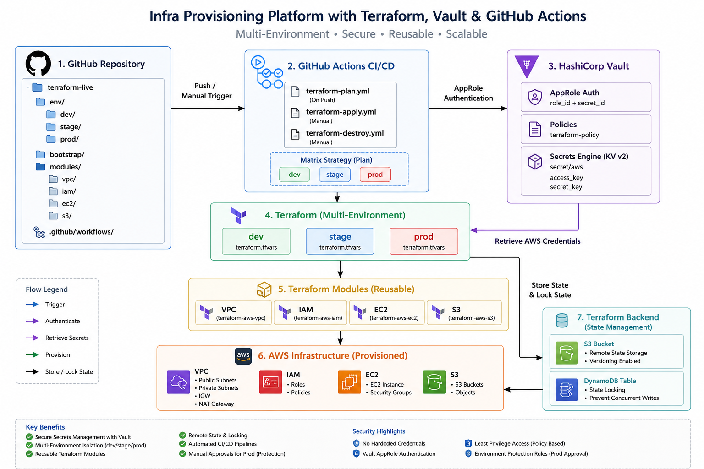
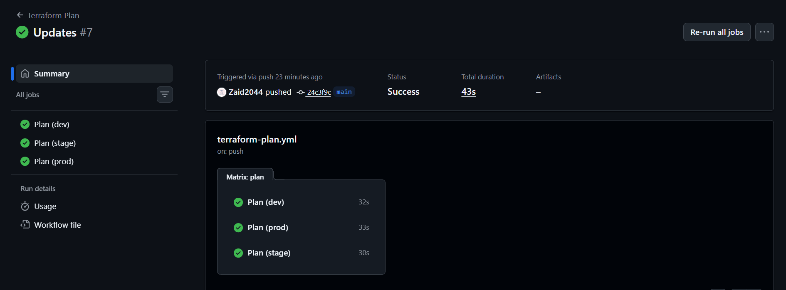
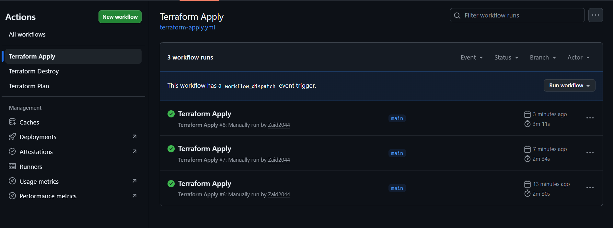
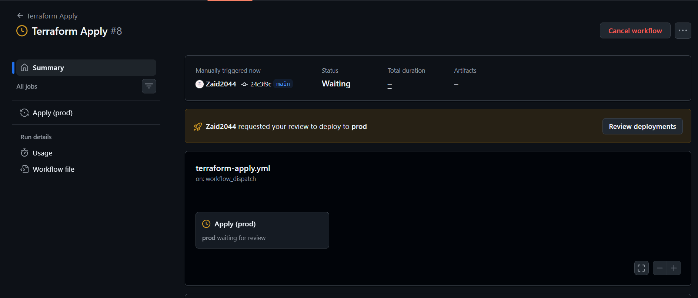
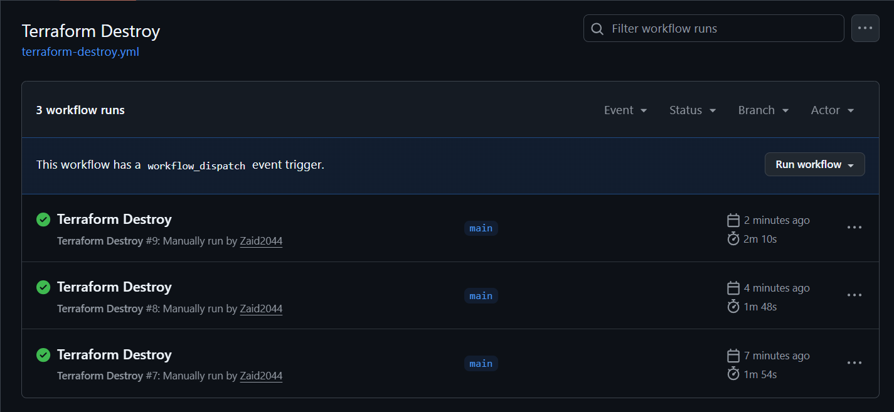
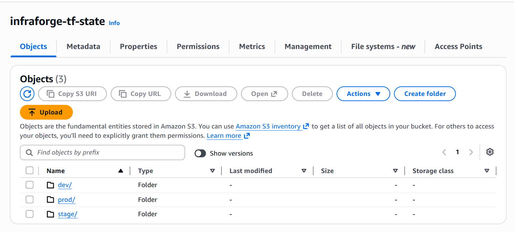

# InfraForge

A secure multi-environment Infrastructure as Code (IaC) platform built using **Terraform, AWS, HashiCorp Vault, and GitHub Actions**.

The project provisions AWS infrastructure through reusable Terraform modules while implementing secure secret management, remote state storage, environment isolation, and automated CI/CD workflows.

---

## Architecture



---

## Features

- Multi-Environment Infrastructure (Dev, Stage, Prod)
- Reusable Terraform Modules
- Secure Secrets Management with HashiCorp Vault
- AppRole Authentication for CI/CD
- GitHub Actions Automation
- Remote State Storage using S3
- State Locking using DynamoDB
- Production Approval Workflow
- Infrastructure Provisioning & Destruction Pipelines

---

## Infrastructure Components

### VPC Module
- VPC
- Public & Private Subnets
- Internet Gateway
- NAT Gateway
- Route Tables

### IAM Module
- IAM Roles
- Managed Policies
- Instance Profiles

### EC2 Module
- EC2 Instances
- Security Groups

### S3 Module
- Environment-specific S3 Buckets

---

## CI/CD Pipeline

### Terraform Plan

Automatically validates and generates execution plans across all environments.



### Terraform Apply

Manual deployment workflow with environment selection.



### Production Approval

Production deployments require explicit approval before execution.



### Terraform Destroy

Protected infrastructure destruction workflow with confirmation controls.



---

## Remote State Management

Terraform state is centrally managed using:

- Amazon S3 Backend
- DynamoDB State Locking



---

## Security Flow

```text
GitHub Actions
        │
        ▼
HashiCorp Vault
(AppRole Authentication)
        │
        ▼
AWS Credentials
        │
        ▼
Terraform Execution
        │
        ▼
AWS Infrastructure
````

---

## Technology Stack

* Terraform
* AWS (VPC, EC2, IAM, S3, DynamoDB)
* HashiCorp Vault
* GitHub Actions
* Git

---

## Highlights

* Built reusable Terraform modules hosted in separate repositories.
* Implemented secure secret management using Vault AppRole authentication.
* Designed isolated Dev, Stage, and Production environments.
* Automated infrastructure planning, deployment, and destruction using GitHub Actions.
* Configured remote state management with S3 and DynamoDB locking.
* Enforced production deployment approvals and controlled infrastructure changes.

## 👨‍💻 Author
**Mohammed Zaid Ahmed**
Terraform • AWS • DevOps • Platform Engineering